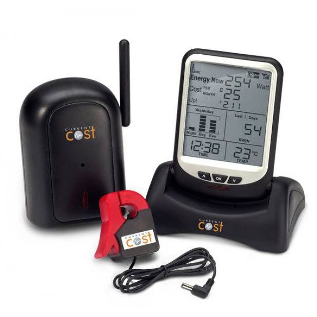

# EnigmaIOT CurrentCost Energy Monitor Controller

Energy monitoring based on EnigmaIOT library, using an old [CurrentCost Envir](http://www.currentcost.com/product-envir.html) connected to an ESP8266.



It measures main input current at home and up to 9 individual appliance monitors.

This code uses my CurrentCost library to decode serial messages from EnviR: https://github.com/gmag11/CurrentCostLib

You can find how to connect it to ESP8266 on this [Hackaday project](https://hackaday.io/project/4133-currentcost-envir-io-board-mod-w-esp8266).

Using a Gateway loaded with [EnigmaIOTGatewayMQTT](https://github.com/gmag11/EnigmaIOT/tree/master/examples/EnigmaIOTGatewayMQTT) example it uses MQTT as interface to send messages and receive commands. Besides standard EnigmaIOT messages and commands this firmware implements these custom ones.

EnigmaIOT network is configured during first start up using WiFi portal on device. Connect to EnigmaIOTNodexxxxxxx AP and open a web browser on http://192.168.4.1.

This node does not add any additional configuration parameters.

## Messages

#### Sensor measurement

Everytime CurrentCost Envir makes a measurement it sends a message

```
<Network name>/<node name>|<node address>/data {"sens":<sensor number>,"w":<power>}
```

**Example**

`EnigmaIOT/ccost/data`		`{"sens":1,"w":345}`  ---> Sensor 1 measured 345 watts

#### Ambient temperature

CurrentCost Envir measures ambient temperature. It is sent together with sensor 0 power measurement.

Temperature measurement is very unstable so code includes some filtering. Data included filtered adn raw temperature.

```
<Network name>/<node name>|<node address>/data {"sens":0,"w":<power>,"tempr":<filtered temperature>,"raw_tempr":<raw temperature>}
```

**Example**

`EnigmaIOT/ccost/data`    `{"sens":0,"w":1356,"tempr":24.83,"raw_tempr":26.19}` ---> Sensor 0 measures 1356 W, smoothed temperature is 24.83ºC, raw temperature is 26.19ºC

## Commands

This node does not implement any custom command